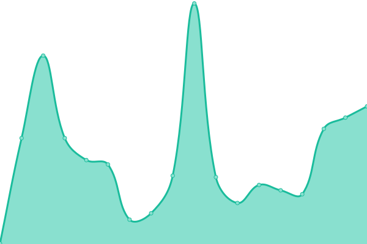

# [📈 Live Status](https://fairpm.github.io/status): <!--live status--> **🟩 All systems operational**

This repository contains the open-source uptime monitor and status page for [FAIR Project](https://fair.pm/), powered by [Upptime](https://github.com/upptime/upptime).

<!--start: status pages-->
<!-- This summary is generated by Upptime (https://github.com/upptime/upptime) -->
<!-- Do not edit this manually, your changes will be overwritten -->
<!-- prettier-ignore -->
| URL | Status | History | Response Time | Uptime |
| --- | ------ | ------- | ------------- | ------ |
|  [FAIR](https://fair.pm) | 🟩 Up | [fair.yml](https://github.com/fairpm/status/commits/HEAD/history/fair.yml) | 

 217ms
     
 | 

<a href="https://fairpm.github.io/status/history/fair">100.00%</a>
    

|  [AspirePress](https://aspirepress.org/) | 🟩 Up | [aspire-press.yml](https://github.com/fairpm/status/commits/HEAD/history/aspire-press.yml) | 

 203ms
     
 | 

<a href="https://fairpm.github.io/status/history/aspire-press">100.00%</a>
    

<!--end: status pages-->

## 🛠️ Configuration

This more or less runs automated without the need for intervention.

- Basic config, including monitored sites, is in `.uptimerc.yml`
- CSS is configured in the `assets/fair-theme.css` file.
- Custom log is `assets/logo.svg` (note that the logo is a placeholder for now)

To make updates, create a branch from `master` (no we cannot rename it, as it's dependant on the parent template), make your changes, and merge back into `master`.

## 🚨 Incidents, Outages, and Planned Maintenance

If the monitored sites (see `.uptimerc.yml`) go down, a new issue will be opened in Github and Slack will be alerted. If the site comes back up, the issue will be closed.

> When a specified endpoint goes down, Upptime automatically opens a new issue in your GitHub repository. You can use this issue to add more information about the outage, such as whether you are investigating, what caused the downtime, etc.

There is a custom issue template for "Maintenance Event" to be used for any planned outages.

## 📄 License

- Powered by: [Upptime](https://github.com/upptime/upptime)
- Code: [MIT](./LICENSE) © [Anand Chowdhary](https://anandchowdhary.com), supported by [Pabio](https://pabio.com)
- Data in the `./history` directory: [Open Database License](https://opendatacommons.org/licenses/odbl/1-0/)
